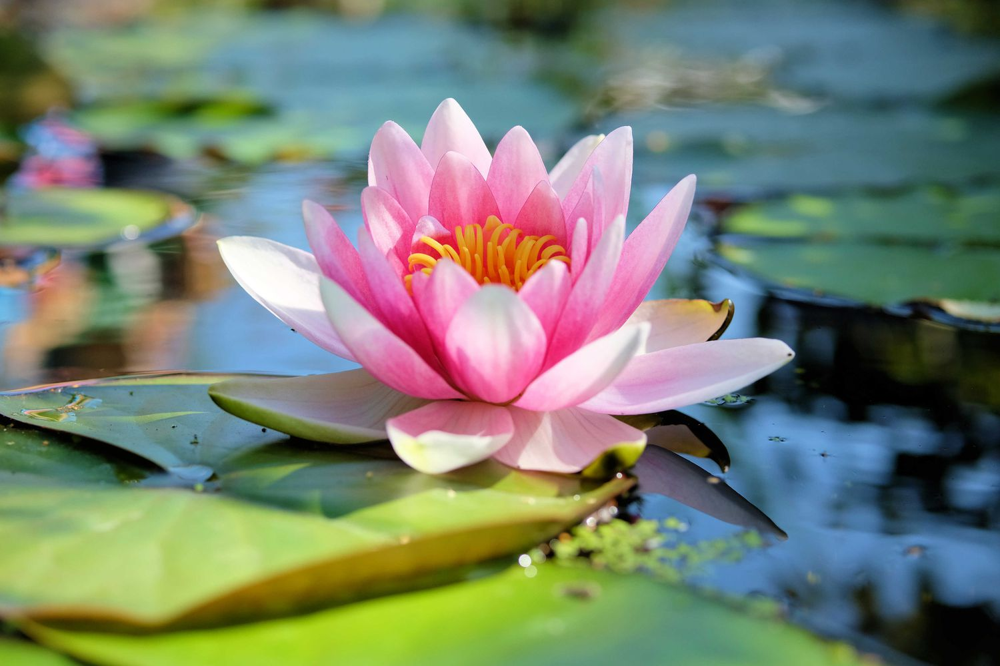

# Raster To Vector Conversion

- Validate package - ```@neplex/vectorizer```
- Explore feasibility of image conversion from raster format to vector (svg) format.

---


## Setup Instructions

```bash
# 1. Install dependencies
npm install  

# 2. Run the script
npm run start
```


## Observation

- Resulting in increased image size compared to the original image.
- Decrease in image quality and sharpness.
- Animated images with raw colors have better conversion quality compared to images of real life (humans, plants, etc.) subjects.
- Conversion time varies with image size and format. Might cause performance overhead


## Examples

| Raster Image (PNG Input)                                                                                                                                                                                                         | Vector Image (Generated SVG)                                                                                                                                                                                                 |
| -------------------------------------------------------------------------------------------------------------------------------------------------------------------------------------------------------------------------------- | ---------------------------------------------------------------------------------------------------------------------------------------------------------------------------------------------------------------------------- |
| <br/>| <br/>|